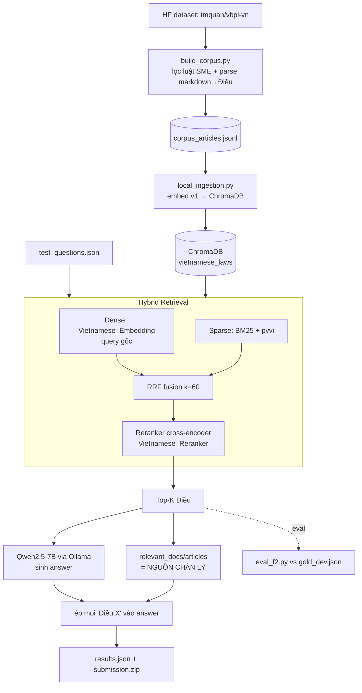

# Pipeline & Giải pháp Kỹ thuật

> Chi tiết kiến trúc, công nghệ (kèm lý do), lưu ý vận hành, và trạng thái giải pháp.
> Đề bài: [competition-overview.md](competition-overview.md) · Review gốc: [../plans/reports/researcher-260603-1442-competition-pivot-offline-pipeline-review.md](../plans/reports/researcher-260603-1442-competition-pivot-offline-pipeline-review.md)

## 1. Định hướng giải pháp

**Offline Batch Pipeline** sinh `results.json`, KHÔNG phải web app realtime.

**Vì sao:** Cuộc thi chấm trên file nộp offline; mô hình đóng (Gemini/GPT) bị cấm. Bản web-app ban đầu (Google Antigravity SDK + Gemini API) **bị loại tư cách 100%** → đã pivot. Code web-app cũ (`agent.py`, `rag_engine.py`, `main.py`, `frontend/`) giữ lại làm tham khảo, **không dùng để nộp**.

Bài toán cốt lõi = **IR + RAG**. Điểm IR (F2) tự động, chấm hàng tuần, có ngay → **ưu tiên retrieval trước**, QA sau.

## 2. Sơ đồ pipeline

## 3. Các giai đoạn

| # | Giai đoạn | Module | Mô tả |
|---|---|---|---|
| 1 | Build corpus | `backend/build_corpus.py` | Stream `tmquan/vbpl-vn` (158k docs), lọc theo allowlist mã văn bản SME (hoặc keywords), parse `markdown` → Điều-level, ghi `data/corpus_articles.jsonl` |
| 2 | Ingestion | `backend/local_ingestion.py` | Đọc JSONL, embed mỗi Điều bằng `Vietnamese_Embedding`, upsert ChromaDB (cosine), fail-loud nếu lỗi embed |
| 3 | Retrieval | `backend/local_rag_engine.py` | Dense (query gốc) ‖ Sparse (BM25) → RRF → rerank → Top-K, dedup theo (mã, Điều) |
| 4 | Rerank | `backend/local_reranker.py` | CrossEncoder chấm lại (query, Điều) — khâu ROI cao nhất |
| 5 | Sinh đáp án | `backend/local_llm_client.py` | Ollama `/api/chat`, prompt grounding ép trích dẫn Điều |
| 6 | Submission | `scratch/generate_submission.py` | Fields từ retrieval (chân lý) + ép citation vào answer + validate schema + zip phẳng |
| 7 | Eval | `scratch/eval_f2.py` | P/R/F2 macro vs `data/gold_dev.json` (match trên (mã, Điều)) |
| — | Config | `backend/local_models_config.py` | Model, path, allowlist tập trung (DRY) |
| — | Parser | `backend/legal_text_parser.py` | `parse_legal_name` + `split_into_articles` (robust markdown phẳng) |

## 4. Công nghệ & lý do chọn

| Thành phần | Lựa chọn | Lý do | Tuân thủ |
|---|---|---|---|
| **Embedding** | `AITeamVN/Vietnamese_Embedding` (v1) | BGE-M3 fine-tune cho VN, mạnh nhất domain legal. **Chọn v1 không v2** vì v2 giảm điểm legal dù train nhiều hơn | MIT, 0.6B, 2025 ✅ |
| **Reranker** | `AITeamVN/Vietnamese_Reranker` | Cross-encoder (BGE-reranker-v2-m3) — rerank tăng Recall@5 ~0.70→0.82 (nghiên cứu). Khâu ăn điểm precision lớn nhất | MIT, 0.6B, 2025 ✅ |
| **LLM** | `Qwen2.5-7B-Instruct` (q4_K_M, Ollama) | Mạnh, đa ngữ tốt tiếng Việt, chạy mượt Mac M4 16GB (~5GB). Instruct (không reasoning) → format citation ổn định | Apache-2.0, 7.6B, 09/2024 ✅ |
| **Sparse** | `rank_bm25` (BM25Okapi) | Khớp từ khóa chính xác (số điều, thuật ngữ luật) mà dense bỏ sót | — |
| **Word segment** | `pyvi` (optional) | Tách từ tiếng Việt → BM25 tốt hơn (dense dùng raw text). Fallback regex nếu thiếu | — |
| **Fusion** | RRF (k=60) | Gộp rank dense+sparse không cần chuẩn hóa score (tránh lệch thang điểm) | — |
| **Vector store** | ChromaDB (persistent, cosine) | Nhẹ, embed-sẵn, đủ cho corpus vài nghìn–chục nghìn Điều | — |
| **LLM runtime** | Ollama | Chạy LLM local tách process (quản RAM riêng), API đơn giản | — |

**Phần cứng mục tiêu:** Mac Mini M4, 16GB RAM (MPS). Module hóa để đổi model 14B hoặc endpoint GPU ngoài không sửa logic lõi.

## 5. Quyết định thiết kế quan trọng

1. **Citation tách khỏi LLM (chân lý từ retrieval).** `relevant_docs/articles` điền **trực tiếp** từ Điều đã truy hồi+rerank, KHÔNG parse ngược từ answer LLM. Sau đó **ép** mọi "Điều X" xuất hiện trong `answer` (grader trích từ answer text). → Điểm IR không phụ thuộc LLM có ngoan không.
2. **Granularity = Điều.** Mọi chunk corpus là 1 Điều, mang `(doc_number, article)`. Khớp đúng chuẩn chấm `mã|tên|Điều X`.
3. **`mã văn bản` = khóa join.** Corpus phải có `doc_number` chính xác; sai/thiếu mã → 0 điểm dù retrieval đúng.
4. **Bỏ slang / PII / time-filter / resolve_conflicts** (có trong web-app cũ). Câu hỏi thi văn phong chuẩn → slang/PII vô dụng; time-filter & hierarchy re-sort còn **drop nhầm Điều gold** → hại recall. KISS.
5. **F2 recall-bias.** F2 ưu ái recall 2× → chọn K hơi cao (3→5→8), reranker lọc precision. Cân bằng qua đo F2 nội bộ.
6. **Allowlist mã văn bản SME** (không lọc theo `legal_area` vì dataset đa số "Chưa phân loại"). Allowlist = trần recall, dễ mở rộng trong `local_models_config.py`.

## 6. Lưu ý vận hành

- **Xóa ChromaDB cũ** trước khi ingest: `rm -rf data/chroma_db` (tránh trộn embedding Gemini cũ / khác dimension).
- **RAM staging:** chạy `--no-llm` để sinh/ chấm IR trước (chỉ embedding+reranker), tách khỏi LLM. 20 câu nhẹ nên load đồng thời vẫn ổn.
- **Kiểm corpus coverage:** sau `build_corpus.py`, xem log `Allowlist found X/12` + cảnh báo MISSING; **grep JSONL đếm Điều mỗi luật** (Bộ luật Lao động phải ~220 Điều, không phải vài Điều → nếu ít: markdown format lạ).
- **Reproducibility (paper):** pin commit hash HF của embedding/reranker, seed, version (xem `requirements-local.txt`).
- **Reranker load:** nếu `CrossEncoder("AITeamVN/Vietnamese_Reranker")` lỗi → thử `FlagEmbedding.FlagReranker`.

## 7. Trạng thái hiện tại

- ✅ Code pipeline hoàn chỉnh, compile sạch, parser test pass (kể cả markdown phẳng).
- ✅ Code review xong (2 Critical + 4 High đã fix).
- ⏳ **Chưa chạy runtime thực** (cần máy user: download dataset GB + Ollama + model).
- ⏳ `gold_dev.json` là **gold TẠM** do Claude suy từ kiến thức pháp luật (BLLĐ 45/2019, Luật DN 59/2020...) — chỉ để so sánh tương đối giữa các lần chỉnh, **không** dự đoán điểm leaderboard tuyệt đối.

## 8. Hạn chế & việc cần làm

- [ ] Chạy `build_corpus.py` thật → verify coverage 12 luật allowlist.
- [ ] Verify reranker load OK trên máy.
- [ ] Mở rộng allowlist nếu test set thật chiếu tới luật ngoài danh sách.
- [ ] (Tùy) tích hợp `phapdien`/`anle` để tăng phủ.
- [ ] Verify/chỉnh `gold_dev.json` để đo F2 đáng tin hơn.
- [ ] Tinh chỉnh K theo F2 nội bộ.

## 9. Câu hỏi mở

1. Mâu thuẫn "không dữ liệu ngoài" vs "tự thu thập corpus" (xem đề bài §9) — chặn chiến lược corpus.
2. Cơ chế IR scoring chính xác (full identifier ghép từ đâu).
3. Reasoning model (DeepSeek-R1-distill) có đáng thử cho QA content score không (rủi ro phá format)?
