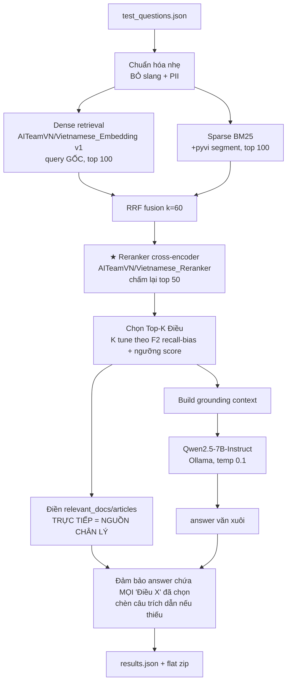

# Research Report: Pivot Web App → Offline Batch Pipeline + Review Pipeline Cuộc thi Vietnamese Legal IR/QA

**Ngày:** 2026-06-03 14:42 (UTC+7) · **Loại:** Research + Pipeline Review · **Trạng thái code:** đã có bản nháp `local_*.py` + ChromaDB 462MB

---

## Executive Summary

**Pivot là ĐÚNG và BẮT BUỘC.** Luật thi cấm tuyệt đối model đóng (GPT/Gemini). Toàn bộ stack `backend/agent.py` + `rag_engine.py` (Google Antigravity + Gemini embedding `text-embedding-004` + `gemini-3.1-flash`) **bị loại tư cách 100%**. Web app không có giá trị chấm điểm — cuộc thi chấm trên file `results.json` offline. Hướng "Offline Batch Pipeline" của bạn đúng bản chất.

**3 rủi ro lớn nhất (xếp theo mức độ):**
1. **Mâu thuẫn luật "không dùng dữ liệu ngoài" vs "tự thu thập corpus"** → phải hỏi BTC. Quyết định toàn bộ cách build corpus. (Chi tiết §2.2)
2. **Corpus = cuộc thi.** BTC KHÔNG cấp corpus. Recall bị chặn trần bởi độ phủ corpus + độ chính xác `mã văn bản`. Corpus hiện tại (169 luật chung: Thư viện, Giáo dục, Cảnh sát biển...) **lệch trọng tâm SME**. (§3.1)
3. **Chọn sai embedding model.** Bạn chọn `Vietnamese_Embedding_v2` — research xác nhận v2 **kém hơn v1 ở domain legal**. Phải dùng `AITeamVN/Vietnamese_Embedding` (v1). (§2.1)

**Thiếu sót kỹ thuật nặng nhất:** Plan ghi có reranker nhưng `local_rag_engine.py` **KHÔNG có reranker** — đây là khâu ROI cao nhất (research: Recall@5 0.695→0.816 khi thêm rerank). Và logic điền citation đang phụ thuộc LLM + có **bug match theo số Điều bỏ qua văn bản**.

**Điểm benchmark tham chiếu:** ALQAC 2024 best retrieval F2 ≈ **87%**. Đó là trần thực tế để định cỡ kỳ vọng.

---

## 1. Vì sao pivot: Web App → Batch Model Pipeline

| Khía cạnh | Web App cũ (bị loại) | Batch Pipeline mới (đúng) |
|---|---|---|
| LLM | Gemini (đóng) ❌ | Qwen2.5-7B (Apache, mở) ✅ |
| Embedding | Gemini `text-embedding-004` (đóng) ❌ | BGE-M3 VN (mở) ✅ |
| Đầu ra chấm điểm | API chat realtime — KHÔNG được chấm | `results.json` + zip — đúng cơ chế ✅ |
| Mục tiêu | UX, biểu mẫu, PII | F2 retrieval + chất lượng answer |

→ Mọi thứ liên quan Antigravity/Gemini (`agent.py`, `document_generator.py`, hooks PII, slang, FastAPI) **không dùng cho bài thi**. Giữ lại chỉ: parser DOCX, cấu trúc Điều/Khoản/Điểm, ý tưởng hybrid search. Cuộc thi là **bài toán IR + RAG offline**, không phải sản phẩm web.

---

## 2. Audit Tuân thủ (Compliance)

### 2.1 Models — kiểm tra hạn 01/03/2026, <14B, mở

| Model | Ngày phát hành | Params | License | Verdict |
|---|---|---|---|---|
| **Qwen2.5-7B-Instruct** | 19/09/2024 | 7.6B | Apache-2.0 | ✅ An toàn nhất (LLM chính) |
| DeepSeek-R1-Distill-Qwen-7B | 20/01/2025 | 7.6B | MIT | ✅ Hợp lệ, NHƯNG model reasoning (sinh `<think>`, chậm, dễ phá format citation) → không khuyến nghị cho task trích dẫn |
| Gemma-2-9B-it | 27/06/2024 | 9.2B | **Gemma License** | ⚠️ Mở cho nghiên cứu nhưng KHÔNG phải OSI open-source → rủi ro nhẹ với chữ "mã nguồn mở". Tránh nếu muốn chắc |
| ~~Qwen2.5-14B~~ | 10/2024 | **14.7B** | Apache | ❌ **VƯỢT "<14B"** → loại. TUYỆT ĐỐI KHÔNG DÙNG |
| **AITeamVN/Vietnamese_Embedding** (v1) | 2025 (Q1-Q2) | 0.6B, 1024-dim | MIT (BGE-M3) | ✅ **Chọn cái này** — tốt nhất cho legal VN |
| AITeamVN/Vietnamese_Embedding_v2 | 2025 | 0.6B | MIT | ⚠️ Train 1.1M triplet nhưng **giảm điểm domain legal** vs v1 → KHÔNG dùng cho bài này |
| `thanhtantran/Vietnamese_Embedding_v2` (bạn đang dùng) | ? (re-upload GGUF) | — | — | ⚠️ Bản re-up, chưa xác nhận ngày/nguồn → rủi ro tái lập. Dùng bản gốc AITeamVN |
| **AITeamVN/Vietnamese_Reranker** | 2025 | 0.6B (BGE-reranker-v2-m3) | MIT | ✅ Thêm vào (đang thiếu) |

> ⚠️ Embedding/reranker cũng là "model" → cũng phải pre-01/03/2026 + mở. AITeamVN (2025, MIT) đạt. **Phải pin commit hash HF** để chứng minh trong working-notes paper.

### 2.2 Dữ liệu — MÂU THUẪN NGHIÊM TRỌNG cần hỏi BTC

- **Overview nói:** "người tham gia KHÔNG được sử dụng dữ liệu bên ngoài trong bất kỳ bước xử lý nào".
- **Data section nói:** "BTC không cấp dữ liệu huấn luyện. Các đội được toàn quyền thu thập... văn bản pháp luật, open dataset Legal NLP...".

→ Hai điều khoản **đá nhau trực tiếp**. Cách đọc hợp lý nhất: BTC không cấp corpus nên **buộc phải tự thu thập corpus luật** (không có corpus thì retrieval = bất khả thi); "dữ liệu ngoài" cấm = **không dùng tập QA/nhãn liên quan có thể lộ phân phối test, không dùng đáp án**. NHƯNG mức độ mâu thuẫn đủ lớn để **email BTC xác nhận trước khi đổ công sức**. Đây là câu hỏi #1.

---

## 3. Đánh giá Pipeline hiện tại (grounded theo code thực tế)

### 3.1 Corpus — điểm yếu chí mạng

- **`document_registry.json` = 169 luật chung**, lệch SME. Câu hỏi thi xoay quanh: Luật Doanh nghiệp, Luật Hỗ trợ DNNVV, Bộ luật Lao động, Luật Thương mại, Luật Quản lý thuế + Nghị định/Thông tư hướng dẫn. **Phải verify các luật cốt lõi này có trong corpus**:
  - Luật Doanh nghiệp `59/2020/QH14`
  - Luật Hỗ trợ DNNVV `04/2017/QH14` + NĐ `80/2021/NĐ-CP`
  - Bộ luật Lao động `45/2019/QH14` + NĐ `145/2020/NĐ-CP`
  - Luật Thương mại `36/2005/QH11`
  - Luật Quản lý thuế `38/2019/QH14`
- **`code` (mã văn bản) là KHÓA JOIN chấm điểm.** `parse_legal_name()` (ingestion:18) trích code bằng regex từ `law_name`. Nếu `law_name` trong registry thiếu/sai mã → `code=""` → submission sai khóa → **0 điểm dù retrieval đúng**. → Phải chạy validation: mọi doc có `code` khớp regex `\d+/\d+/[A-Z...]`.
- Độ phủ corpus quyết định **trần Recall**. Thiếu 1 Nghị định gold → mọi câu hỏi chiếu tới nó = recall 0.

### 3.2 Granularity — ✅ ĐÚNG (điểm sáng)

`local_ingestion.py` parse parent=Điều, child=Khoản/Điểm, mọi record mang `article="Điều X"`. Parent-child collapse (rag_engine:211-237) trả về Điều với field `article` đúng. **Phù hợp chuẩn chấm `law_id|tên|Điều X`.** Giữ nguyên thiết kế này.

### 3.3 Retrieval — thiếu reranker + vài lựa chọn hại điểm

| Vấn đề | File:dòng | Tác động | Sửa |
|---|---|---|---|
| **THIẾU RERANKER** (plan có, code không) | rag_engine.py toàn bộ | Mất khâu ROI cao nhất (+12% Recall@5) | Thêm CrossEncoder sau RRF |
| Embedding v2 (kém legal) | ingestion:69, rag_engine:28 | Giảm recall domain legal | Đổi `AITeamVN/Vietnamese_Embedding` |
| Dense encode dùng query đã chèn slang | rag_engine:141,162 | Slang làm nhiễu vector dense | Dense dùng query GỐC; BM25 mới dùng query mở rộng |
| `resolve_conflicts()` rerank theo thứ bậc luật SAU RRF | rag_engine:206 | Đẩy Điều liên quan nhất xuống dưới Điều ít liên quan nhưng cấp cao hơn → hại F2 | Bỏ, hoặc chỉ dùng làm tiebreak cuối |
| Time-filter `_is_effective_at` (status/expiry) | rag_engine:198-203 | Có thể DROP nhầm Điều gold → mất recall; không có giá trị chấm điểm | **Bỏ** cho bài thi (KISS) |
| BM25 tokenizer `\w+` thô | rag_engine:69,146 | Tiếng Việt đa âm tiết → BM25 yếu | Thêm `pyvi` word segment cho nhánh BM25 |
| Fallback embedding = vector 0 (im lặng) | ingestion:290 | Làm hỏng retrieval âm thầm | Fail loud thay vì zero-vector |

### 3.4 Sinh đáp án + Citation — fragile + 1 bug

- **Bug match citation** (`generate_submission.py:extract_cited_articles`): chỉ match theo **SỐ Điều** (`re.findall(r'Điều\s+(\d+)')`), bỏ qua văn bản nào. Nếu 2 doc retrieved cùng có "Điều 4" từ 2 luật khác nhau, LLM viết "Điều 4" → **CẢ HAI** được thêm vào `relevant_articles` → precision tụt (F2 phạt precision dù nhẹ hơn recall).
- **Phụ thuộc LLM để chấm IR**: IR (F2 — phần tự động, chấm hàng tuần, có điểm ngay) đang lệ thuộc việc LLM có chịu viết đúng "Điều X" không. Mong manh.
- **Đảo kiến trúc (khuyến nghị mạnh):** retrieval+rerank **quyết định** tập Điều → điền `relevant_docs`/`relevant_articles` **trực tiếp** (nguồn chân lý) → rồi **ép** mọi "Điều X" đó xuất hiện trong `answer`. LLM chỉ lo văn xuôi, không lo chọn điều. Tách IR khỏi hallucination LLM.

### 3.5 Tiền xử lý thừa cho bài thi

- **Slang map** (đuổi việc→sa thải...) + **PII redaction**: thiết kế cho input người dùng đời thường. Câu hỏi thi là **văn phong pháp lý chuẩn** (vd "Doanh nghiệp nhỏ và vừa phải đáp ứng điều kiện nào..."). Slang gây nhiễu, PII vô dụng. → **Bỏ** (KISS/YAGNI).

### 3.6 Vận hành (Mac Mini M4 16GB)

- Embedding (~1.2GB fp16) + Reranker (~1.2GB) + Qwen-7B-q4 Ollama (~5GB) ≈ 8-10GB nếu cùng lúc → OK nhưng sát. **Stage 2 pha**: (A) retrieve+rerank toàn bộ 20 câu → cache `retrieval_cache.json`; (B) load LLM sinh đáp án. Vừa nhẹ RAM vừa tái lập được + debug riêng từng pha.
- ChromaDB 462MB hiện có **3 collection UUID lẫn lộn** + nghi còn embedding Gemini cũ → `clear_database()` đã có (ingestion:72) nhưng nên **xóa sạch `data/chroma_db/` thủ công** rồi ingest lại từ đầu với model mới (dimension/space khác nhau không được trộn).

---

## 4. Kiến trúc Pipeline đề xuất (đã sửa)



**Khác biệt cốt lõi:** mũi tên `FIELDS` tách khỏi `LLM` → IR score độc lập với việc LLM có ngoan không. `RERANK` là khâu mới, ROI cao nhất.

**Tinh chỉnh F2 (recall-bias):** F2 = 5PR/(4P+R) → recall nặng gấp ~2× precision. Nên chọn K hơi cao (thử 3→5→8) + ngưỡng điểm reranker, chấp nhận hi sinh precision đổi recall. NHƯNG không có dev set có gold → **phải tự gán nhãn gold cho 20 câu mock** (hoặc 1 phần) để đo F2, nếu không là mò trong tối.

---

## 5. Danh sách file cần sửa/tạo

| File | Hành động |
|---|---|
| `backend/local_rag_engine.py` | Đổi model→v1; thêm class/stage **Reranker**; bỏ slang/time-filter/resolve_conflicts; dense dùng query gốc, BM25 dùng query+segment; tách hàm `retrieve()` trả Top-K sạch |
| `backend/local_ingestion.py` | Đổi model→v1; bỏ slang; fail-loud thay zero-vector; thêm validate `code` non-empty + log doc thiếu mã |
| `backend/local_reranker.py` [NEW] | Wrap `sentence_transformers.CrossEncoder("AITeamVN/Vietnamese_Reranker")`, hàm `rerank(query, docs, top_k)` |
| `backend/local_llm_client.py` | Prompt: yêu cầu trả lời + LIỆT KÊ chính xác các Điều được cấp; giữ temp thấp |
| `scratch/generate_submission.py` | Đảo luồng: fields từ retrieval (không từ parse LLM); sửa bug match (match theo `code+article` không chỉ số Điều); ép citation vào answer; validate schema (id int, đủ 20 câu) |
| `scratch/build_corpus.py` [NEW] | Thu thập + chuẩn hóa corpus SME từ vbpl.vn (hoặc HF dataset vbpl-vn nếu BTC cho phép); đảm bảo `code` chuẩn |
| `data/gold_dev.json` [NEW] | Tự gán nhãn gold articles cho 20 câu mock → đo F2 nội bộ |
| `backend/requirements-local.txt` [NEW] | Pin: `sentence-transformers`, `chromadb`, `rank_bm25`, `pyvi`, `torch`, (+ commit hash model trong comment) |

---

## 6. Hướng dẫn chạy (bạn tự chạy sau)

### Bước 0 — Cài môi trường
```bash
cd /Users/huubao/Documents/GOKU/Dev/DEV_AI/ai_legal_assistant/backend
# dùng lại venv đã dựng, hoặc tạo riêng cho pipeline local
./venv/bin/pip install sentence-transformers chromadb rank_bm25 pyvi torch
```

### Bước 1 — Cài & chạy Ollama + model
```bash
# cài Ollama (nếu chưa): https://ollama.com/download  (hoặc: brew install ollama)
ollama serve            # chạy nền ở 1 terminal
ollama pull qwen2.5:7b-instruct-q4_K_M
ollama run qwen2.5:7b-instruct-q4_K_M "Xin chào"   # test 1 phát
```

### Bước 2 — Xóa sạch ChromaDB cũ (embedding Gemini bị cấm)
```bash
rm -rf data/chroma_db        # xóa toàn bộ, tránh trộn dimension/model
```

### Bước 3 — (Sau khi sửa code theo §5) build corpus + ingest
```bash
# verify corpus có đủ luật SME cốt lõi trước
python3 scratch/build_corpus.py            # hoặc bổ sung registry thủ công
./venv/bin/python backend/local_ingestion.py
# kỳ vọng log: "Total clauses in ChromaDB: <vài nghìn+>" và 0 doc thiếu code
```

### Bước 4 — Test retrieval + rerank trên vài câu
```bash
./venv/bin/python backend/local_rag_engine.py   # in Top-K Điều cho câu mẫu, kiểm mắt
```

### Bước 5 — Đo F2 nội bộ (nếu đã gán gold_dev.json)
```bash
./venv/bin/python scratch/eval_f2.py    # [tạo mới] tính P/R/F2 macro trên 20 câu
```

### Bước 6 — Sinh submission
```bash
./venv/bin/python scratch/generate_submission.py
cd <thư mục chứa results.json> && zip submission.zip results.json   # zip PHẲNG
unzip -l submission.zip      # xác nhận chỉ có results.json ở gốc
```

### Bước 7 — Nộp
- Upload `submission.zip` tại http://leaderboard.aiguru.com.vn/ → My Submissions.
- Tên file BẮT BUỘC `results.json`. Giới hạn 10 bài/ngày; Private Phase chỉ 5 bài tổng.

---

## 7. Checklist trước khi nộp (format gotchas)

- [ ] `id` kiểu **integer** (không phải string).
- [ ] Đủ **toàn bộ** câu hỏi trong test set (thiếu câu = bài không hợp lệ).
- [ ] `relevant_docs` = `mã|tên`; `relevant_articles` = `mã|tên|Điều X`.
- [ ] `mã văn bản` khớp CHÍNH XÁC (vd `04/2017/QH14`) — đây là khóa join.
- [ ] Mọi "Điều X" trong `relevant_articles` xuất hiện trong `answer` (vì IR parse từ answer text).
- [ ] zip PHẲNG, chỉ `results.json` ở gốc, không thư mục con.
- [ ] Pin model revision + seed + version cho working-notes paper (điều kiện công nhận kết quả).

---

## 8. Câu hỏi chưa giải quyết (HỎI BTC / quyết định)

1. **[CHẶN] Mâu thuẫn "không dữ liệu ngoài" vs "tự thu thập corpus"** — được dùng corpus luật tự crawl tới mức nào? Được dùng HF dataset vbpl-vn (CC BY 4.0) không, hay chỉ crawl thô từ vbpl.vn? Toàn bộ chiến lược phụ thuộc câu này.
2. **Định dạng `<tên văn bản>`**: công thức ghi "Loại + Mã + Trích yếu" nhưng ví dụ gold lại bỏ mã trong tên ("Luật Hỗ trợ doanh nghiệp nhỏ và vừa"). Matching dựa trên `mã` (chính) hay cả `tên` (fuzzy)? → ảnh hưởng cách build `clean_name`.
3. **IR scoring chính xác**: F2 lấy "Điều X" parse từ `answer` text, rồi ghép `mã|tên` từ đâu — từ `relevant_articles` mình nộp, hay tự suy? Nếu chỉ từ answer text thì `relevant_*` fields chỉ phục vụ QA eval.
4. **Test set thật** (phát hành 03/06/2026) có bao nhiêu câu, phủ lĩnh vực nào? 20 câu mock của bạn có đại diện không?
5. **Có cần answer "tư vấn sơ bộ + cảnh báo giới hạn"** không, hay chỉ cần answer chứa căn cứ Điều? (QA eval 5 tiêu chí có "tính thực tiễn" → có thể cần).
6. **Reasoning model** (DeepSeek-R1-distill) có đáng thử cho QA content score không, hay rủi ro phá format > lợi ích?

---

## Nguồn

- [Qwen2.5-7B-Instruct (HF) — 19/09/2024, Apache](https://huggingface.co/Qwen/Qwen2.5-7B-Instruct)
- [Gemma-2-9B release — 27/06/2024](https://ai.google.dev/gemma/docs/releases)
- [DeepSeek-R1-Distill-Qwen-7B (HF) — 20/01/2025, MIT](https://huggingface.co/deepseek-ai/DeepSeek-R1-Distill-Qwen-7B)
- [AITeamVN/Vietnamese_Embedding (BGE-M3, 1024-dim, 2025)](https://huggingface.co/AITeamVN/Vietnamese_Embedding)
- [ViRanker: BGE-M3 cross-encoder VN reranking (arXiv 2509.09131)](https://arxiv.org/abs/2509.09131)
- [ALQAC 2024 (best retrieval F2 ≈ 87%)](https://alqac.github.io/)
- [Improving Vietnamese Legal Document Retrieval using Synthetic Data (arXiv 2412.00657)](https://arxiv.org/abs/2412.00657)
- [BAAI/bge-m3 (dense+sparse hybrid, MIT)](https://huggingface.co/BAAI/bge-m3)
- [Hybrid + neural rerank: Recall@5 0.695→0.816](https://qdrant.tech/documentation/advanced-tutorials/reranking-hybrid-search/)
