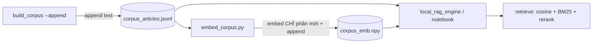

# Research: turbovec + Kiến trúc nạp tài liệu incremental

**Ngày:** 2026-06-08 10:03 · **Loại:** Research + Architecture

## Executive Summary

**turbovec KHÔNG phù hợp** — nó nén lossy 2-4 bit (đi ngược "giữ float32"), giải bài toán RAM ở quy mô 10 triệu vector. Corpus của ta = 3777 vector × 1024-dim float32 = **~15 MB**, search numpy tức thì. turbovec chỉ thêm lỗi lượng tử + giải vấn đề ta không có → bỏ (YAGNI).

Phần đáng giá: **cấu trúc nạp luật incremental**. Hiện build_corpus ghi đè jsonl + ingestion reset & embed lại toàn bộ → thêm 1 luật phải chạy lại từ đầu. Giải pháp: embeddings lưu `corpus_emb.npy` (float32), **embed 1 lần — thêm luật chỉ embed phần mới rồi append**. Bỏ luôn ChromaDB (gây đau version 1.5.9, và numpy đủ nhanh ở quy mô này + thống nhất local↔Colab).

## turbovec — phân tích

| Tiêu chí | Thực tế | Hệ quả cho ta |
|---|---|---|
| Cơ chế | Lượng tử scalar **2-4 bit** (lossy), search trên vector nén | GIẢM chất lượng vs float32 hiện tại |
| Bài toán giải | 10M vector = 31GB RAM → 4GB | Ta 15MB, không có vấn đề RAM |
| Tốc độ | Nhanh hơn FAISS ở 10M+ | Ta numpy brute-force đã tức thì (3777 vector) |
| Maturity | Alpha, MIT, ICLR 2026 | — |

→ **Sai công cụ.** Embeddings của ta đang float32 đầy đủ (không nén). Không có chất lượng để "cứu". turbovec chỉ hợp khi corpus lên hàng triệu điều.

## Kiến trúc incremental đề xuất (numpy .npy)

```
data/corpus_articles.jsonl   ← text các Điều (chỉ APPEND, không ghi đè)
data/corpus_emb.npy          ← float32 (N × 1024), hàng i ↔ dòng i jsonl
data/corpus_emb_ids.json     ← list id theo thứ tự .npy (kiểm khớp + phát hiện phần mới)
```

**Thêm 1 luật mới:**
```bash
# 1. thêm mã vào SME_LAW_ALLOWLIST (local_models_config.py)
# 2. chỉ fetch+append luật MỚI vào jsonl (bỏ qua luật đã có)
python backend/build_corpus.py --append
# 3. chỉ embed các Điều MỚI (chưa có trong .npy) → append vào .npy
python backend/embed_corpus.py
```
→ Không re-embed toàn corpus. `embed_corpus` so id: nếu jsonl là phần mở rộng của .npy → chỉ embed phần đuôi; nếu lệch → embed lại toàn bộ (an toàn).

**Retrieval** (`local_rag_engine` + notebook): load jsonl + .npy → numpy cosine + BM25 + reranker. Không ChromaDB.



## Vì sao bỏ ChromaDB
- Gây đau pin version (local phải đúng 1.5.9 để đọc file Colab).
- Quy mô 3777-50k vector: numpy cosine tức thì, không cần ANN index.
- Thống nhất 1 backend local↔Colab (notebook vốn đã dùng numpy) → DRY.
- `corpus_emb.npy` portable, incremental tự nhiên (append hàng).

## Việc đã làm
- `embed_corpus.py` [NEW] — embed incremental → corpus_emb.npy.
- `build_corpus.py --append` — chỉ thêm luật mới vào jsonl.
- `local_rag_engine.py` — refactor numpy (.npy), bỏ ChromaDB.
- `local_ingestion.py` — bỏ (thay bằng embed_corpus.py).
- Notebook full — Phase A lưu/tải corpus_emb.npy (incremental + re-run nhanh).

## Câu hỏi mở
1. Khi corpus lên >100k Điều (nếu mở rộng nhiều luật), numpy brute-force vẫn ổn (~vài trăm ms/query); nếu cần nhanh hơn lúc đó mới cân nhắc FAISS-Flat (vẫn float32, lossless) — KHÔNG phải turbovec.
2. build_corpus --append vẫn stream 158k HF để tìm luật mới (~vài phút) — chấp nhận được vì thêm luật không thường xuyên.
